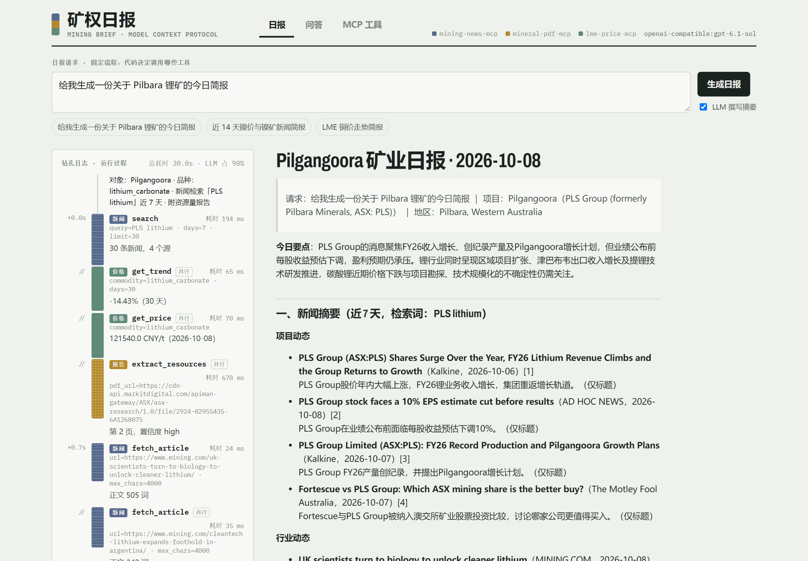
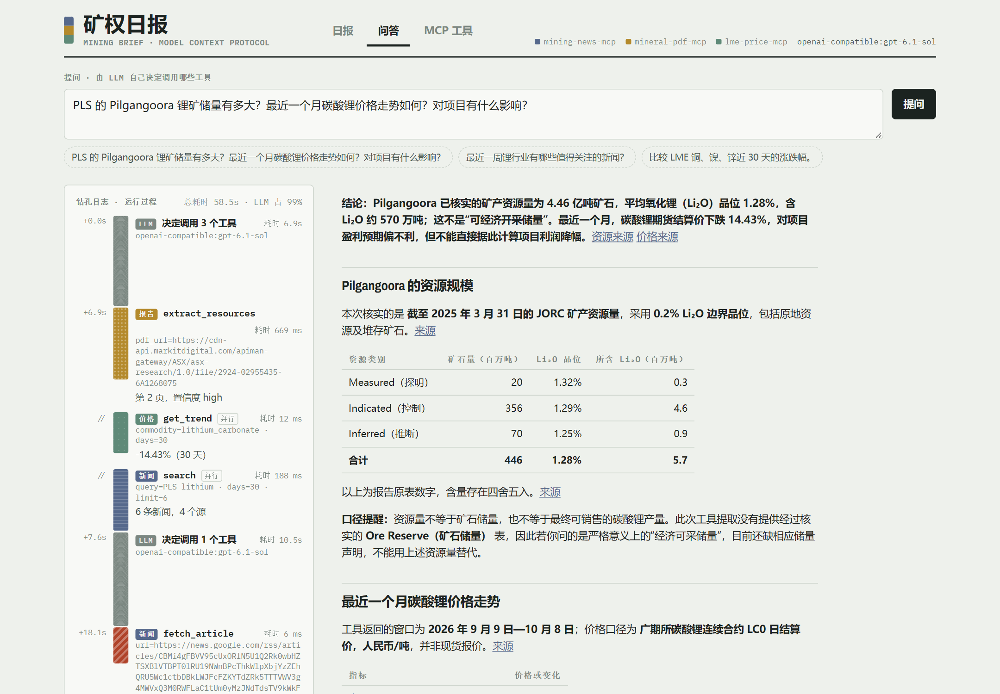
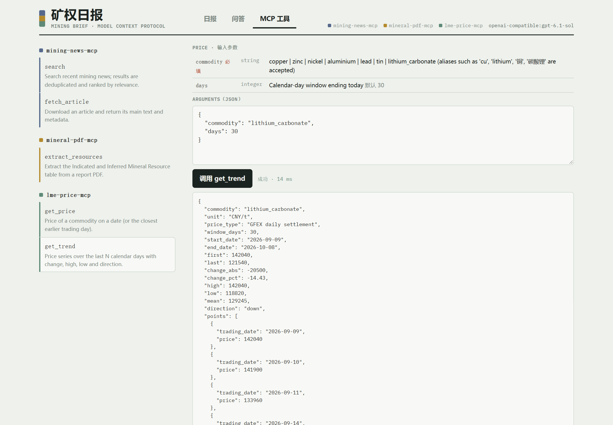

# mining-brief-agent

**中文** | [English](README.en.md)

基于 **MCP（Model Context Protocol）** 的矿业研究 Agent。3 个独立 MCP server 分别提供矿业新闻、NI 43-101 / JORC 资源量和金属价格，Agent 把它们组合成带引用的 Markdown 日报，也能回答自由提问。附带一个 Vue 工作台，能实时看到每一次工具调用。

```text
 「给我生成一份关于 Pilbara 锂矿的今日简报」 / 「Pilgangoora 的储量和锂价对项目有什么影响？」
                │
     ┌──────────┴───────────────────────────────────────────┐
     │  Agent                                                │
     │   日报：固定流程（代码决定调用什么）                      │
     │   问答：LLM 自主决定调用哪些工具、调几轮                    │
     └──────┬────────────────────┬────────────────────┬──────┘
            │ MCP（stdio / Streamable HTTP）           │
   mining-news-mcp        mineral-pdf-mcp        lme-price-mcp
   search                 extract_resources      get_price
   fetch_article          （带自校验 + abstain）    get_trend
   mining.com · Google    ASX 公告 · 任意 PDF      LME（westmetall）· GFEX 碳酸锂
```




<details>
<summary>问答与 MCP 工具页截图</summary>





</details>

## 快速开始

**Web 工作台（推荐）**：

```bash
docker compose up -d --build web
```

打开 http://localhost:8080。「日报」「问答」「MCP 工具」三个页面都会把运行过程画成一根钻孔岩芯：每一段是一次 MCP 调用或一轮 LLM 思考，长度对应耗时。

**命令行，一条命令**：

```bash
docker compose run --rm --build agent
```

**本地 uv**：

```bash
uv sync --locked
uv run mining-brief                      # 日报（默认问题：Pilbara 锂矿）
uv run mining-brief --offline --no-llm   # 不联网、不需要 Key
uv run mining-brief ask "比较 LME 铜、镍、锌近 30 天的涨跌幅"   # 问答（需要 LLM）
```

LLM 是可选的：在 `.env` 里配置 `ANTHROPIC_API_KEY`，或任意 OpenAI 兼容端点（`MB_OPENAI_*`）。没有 Key 时日报自动走确定性模式。完整说明见 [RUN.md](RUN.md)。

## 在 AI 工具里使用这 3 个 MCP server

**最省事：让你的 Agent 自己装。** 在 Claude Code、Cursor 或 Cline 里打开本仓库，发一句：

> 按照 `llms-install.md` 安装并配置这个项目，把它的 3 个 MCP server 接入你自己，然后用 lme-price-mcp 查一次铜价验证。

[`llms-install.md`](llms-install.md) 是写给 AI agent 看的安装步骤，包括前置检查、安装、冒烟测试、各客户端的配置方式和验证方法。

**手动配置**：

| 客户端 | 做法 |
|---|---|
| Claude Code | 仓库自带 [`.mcp.json`](.mcp.json)，在仓库目录打开 Claude Code 时会提示启用；或者手动执行 `claude mcp add --scope local mining-news-mcp -- uv run mining-news-mcp`（3 个 server 各执行一次），再用 `claude mcp list` 确认 |
| Claude Desktop | 把 [`mcp-config.json`](mcp-config.json)（Docker stdio，不依赖路径）合并进 `claude_desktop_config.json`；不用 Docker 的写法见 `llms-install.md` |
| Cursor | 用 [`mcp-config.http.json`](mcp-config.http.json)（先 `docker compose up -d news pdf price`），或者上面的 stdio 写法 |

配置是否可用，可以这样验证：`uv run python scripts/check_mcp_config.py <配置文件>`。脚本会逐个连接 server 并列出工具。

## MCP 工具

| Server | 工具 | 说明 |
|---|---|---|
| `mining-news-mcp` | `search(query, days, limit)` | 合并 mining.com 的搜索、品种和首页 RSS 与 Google News，去重后按 IDF 加权相关度排序 |
| | `fetch_article(url, max_chars)` | 抽取正文，带 SSRF 防护 |
| `mineral-pdf-mcp` | `extract_resources(pdf_url, max_pages)` | 抽取 Measured / Indicated / Inferred 的矿石量、品位和金属量，并做一致性自校验 |
| `lme-price-mcp` | `get_price(commodity, date)` | 指定日（或之前最近一个交易日）的价格 |
| | `get_trend(commodity, days)` | 区间序列、涨跌幅、高低点、均值和方向 |

所有工具都返回结构化结果（`outputSchema` / `structuredContent`），可预期的失败一律以 `ToolError` 返回，每条数据都带 `source_url`、`retrieved_at` 和 `data_mode`。

## 设计要点

- **数字不编造**：储量和价格表格只从工具结果渲染。LLM 只写摘要和风险，引用了不存在的来源编号或没有引用的论断都会被丢弃；问答模式还会检查回答里的每个链接是否真的出现在工具结果中。
- **会 abstain 的储量抽取**：按单位表头解析表格，然后做三项校验：吨位 × 品位 ≈ 金属量、各分类相加 ≈ 合计、Measured + Indicated ≈ M&I。对不上就设 `abstain=true`，只给警告，不给数字。用 6 份真实报告（3 份 JORC、3 份 NI 43-101）维护 ground truth，见 [`tests/data/resource_ground_truth.json`](tests/data/resource_ground_truth.json)。
- **两种 Agent 范式**：日报用固定流程，输出可控、方便评测；问答由 LLM 驱动，有步数和调用次数预算，工具出错会回传给模型让它自行纠正。
- **逐级降级**：读取顺序是新鲜缓存 → 实时请求 → 过期缓存 → 录制快照，每条结果都标注实际来源。单个 server 不可用只影响它对应的章节；没有 LLM 时自动走确定性模式。
- **开箱即跑**：`fixtures/demo/` 是脚本生成的合成示例数据（结构与真实上游一致，不含任何第三方原文），`--offline` / `MB_OFFLINE=1` 完全不联网；需要真实快照时用 `scripts/record_fixtures.py` 录制到本地缓存。

## 工程化

| 项 | 做法 |
|---|---|
| 依赖 | Python 端用 uv + `uv.lock`（Python 3.12）；前端用 npm + `package-lock.json`（Node 22） |
| 质量门禁 | `just check` = ruff format + ruff lint + mypy `--strict` + pytest（122 个离线测试，另有 6 个 live 测试）；前端 vue-tsc strict + vitest |
| 提交前 | pre-commit，与 CI 用同一套锁定工具链 |
| CI | GitHub Actions：Python 门禁、前端构建、Docker 冒烟测试 |
| 测试策略 | MCP server 用 `mcp.Client(server)` 做内存内契约测试；HTTP 用 respx；LLM 用注入的 stub；测试不访问外网 |


## 已知限制

- 价格来自公开转载源（westmetall、新浪财经），不是交易所官方授权数据；铁矿石（上海钢联）需要账号，暂不支持。
- Google News 的链接是 JavaScript 跳转，只能拿到标题和媒体名，取不到正文。
- 储量抽取依赖 PDF 的文本层，扫描件会直接报错，不支持 OCR。
- 项目目录（`agent/catalog.py`）目前只内置 Pilgangoora。其他请求会按品种关键词走通用流程，日报不含储量章节；问答模式可以直接传入任意报告 URL。

## 许可证

**保留所有权利（All Rights Reserved）**，不是开源软件。仓库公开仅供查看；未经版权所有者书面许可，不得使用、复制、修改、分发或以服务形式运行本软件。如需使用，请通过仓库所有者的 GitHub 主页联系。详见 [`LICENSE`](LICENSE)；打包的字体另有其许可，见 [`NOTICE`](NOTICE)。
